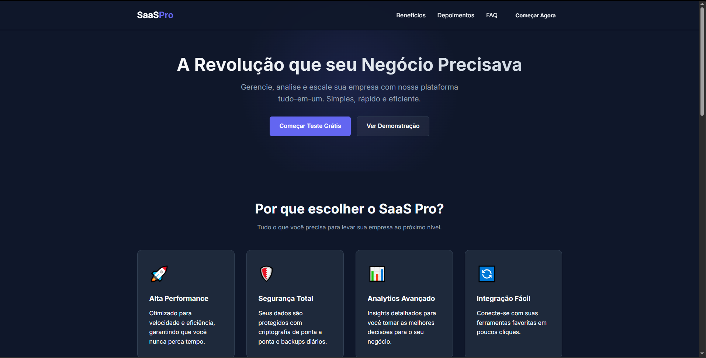

<h1 align="center">SaaS Landing Page</h1>

  Modern landing page built with <strong>React</strong> + <strong>Vite</strong>, focused on conversion, responsiveness and scalable component architecture.

  
  
  

---

## ✨ Features

Fully responsive layout (mobile, tablet, desktop)  
Component-based architecture  
Clear visual hierarchy focused on conversion  
Reusable UI sections  
Clean and organized code structure  

---

## Preview of The Project

---

## 🛠 Tech Stack

React  
Vite  
JavaScript (ES6+)  
HTML5  
CSS3  

---

